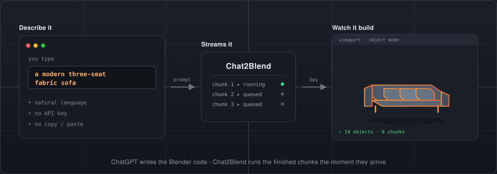
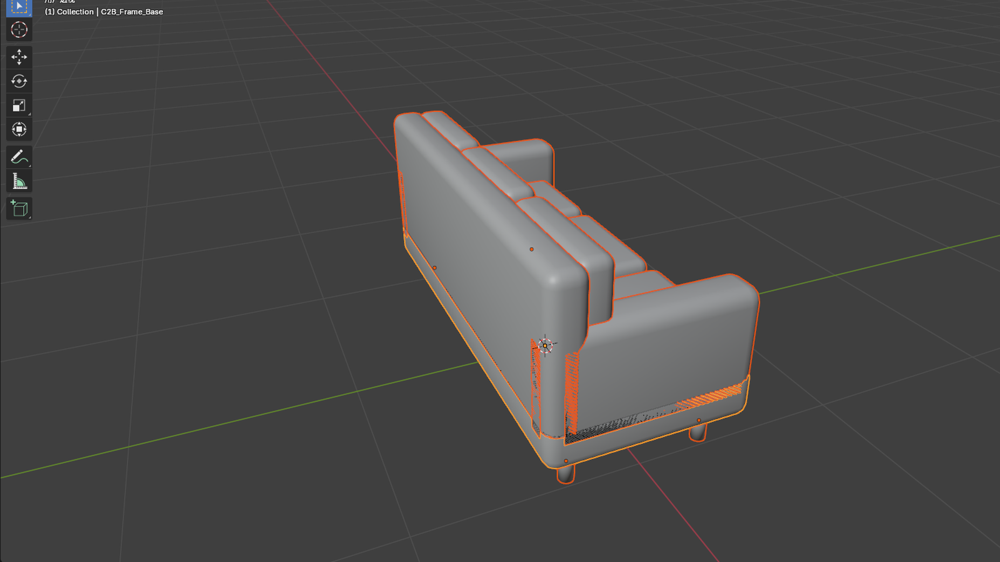

<div align="center">



# Chat2Blend

### 说一句，看 Blender 长出来。

**把 ChatGPT 变成你的实时 3D 建模搭档。**

不用复制粘贴。不用 OpenAI API Key。不用第二个 Coding Agent。

```bash
npm install -g chat2blend
```

[快速开始](#-快速开始3-分钟) · [用起来什么感觉](#用起来什么感觉) · [工作原理](#工作原理) · [English](README.md)

[](https://github.com/nanhudev/chat2blend/actions/workflows/ci.yml)
[](https://www.npmjs.com/package/chat2blend)
[](https://www.npmjs.com/package/chat2blend)
[](./LICENSE)
[](https://nodejs.org)

</div>

---

## 用起来什么感觉？

你在命令行里输入：

```bash
c2b brain "a modern three-seat fabric sofa" --wait
```

ChatGPT 负责写 Blender Python。Chat2Blend 把**每一个写好的代码块立刻**送进 Blender 执行，
而此时后面的代码**还在继续生成**。你什么都不用做，看着沙发一点点长出来 ——
先是一只扶手，再是坐垫，再是三条靠背。

```
你
 │  "a modern three-seat fabric sofa"
 ▼
ChatGPT  ─────  写出 Blender Python
 │
 ▼
Chat2Blend  ───  流式送进已完成的代码块
 │
 ▼
Blender  ──────  实时执行
 │
 ▼
🛋  场景里多了一张沙发
```

下面是**一张真实、未经处理的截图** —— 一次真实的 Blender GUI 运行，
6 个流式 chunk 创建了 14 个对象。

<div align="center">

</div>

<sub><code>a modern three-seat fabric sofa with rounded cushions</code> 的真实输出，流式送进一个可见的 Blender 4.2.9。
右侧大纲视图列出的正是 Chat2Blend 创建的 14 个 <code>C2B_*</code> 对象 ——
<code>Arm_L/R</code>、<code>Back_1..3</code>、<code>Seat_1..3</code>、<code>Leg_1..4</code>、<code>Frame_Base/Back</code>。
这次运行使用合成 chunk（<code>scripts/e2e-blender.mjs</code>），以便单独验证 Blender 执行链路。</sub>

<sub>想看**真实 ChatGPT 会话**的完整往返，见 <a href="docs/PROJECT_STATUS.md">docs/PROJECT_STATUS.md</a> 中的数字：
<code>"a low-poly wooden side table"</code> → 8 个 chunk、38 个对象，第一块几何体在 38.6 秒时出现。</sub>

---

## 为什么要用它？

用 LLM 生成 Blender Python 这件事，本身早就可行了。**真正烦人的是它周围的一切。**

平时你得这样：

1. 问 ChatGPT 要 `bpy` 代码
2. 等它把整段答案写完
3. 复制代码
4. 打开 Blender
5. 粘贴到脚本编辑器
6. 运行
7. 报错了
8. 回到 ChatGPT
9. 重复

Chat2Blend 把中间这些全部砍掉。

你描述想要的资产，ChatGPT 写 Blender 代码，**写完一段就在 Blender 里跑一段**。
你看到的是进度，而不是等一大段文字。

- **不用复制粘贴。** 代码根本不经过你的剪贴板。
- **不用付 API 费用。** 用的是你已经订阅的 ChatGPT 桌面端。
- **不需要第二个 Agent。** 你的 Coding Agent 不必再花 Token 重写 `bpy`。
- **执行是看得见的。** 一切发生在你眼前那个 Blender 窗口里。
- **本地优先。** 只监听回环地址，无隧道、无云端、无遥测。

---

## ⚡ 快速开始（3 分钟）

### 1. 安装

```bash
npm install -g chat2blend
```

需要 **Node.js ≥ 20** 和 **Blender 4.x**。

### 2. 运行 setup

```bash
c2b setup
```

它会检查你的机器，并针对**你这台机器**打印出确切的下一步 ——
包括你需要在 Blender 里选择的那个插件的**绝对路径**。

### 3. 安装 Blender 插件

在 Blender 中：`编辑 ▸ 偏好设置 ▸ 插件 ▸ 安装…`

选择 `c2b setup` 打印出来的路径（以 `blender_addon/chat2blend/__init__.py` 结尾）。

然后启用 **Chat2Blend**，并在 Blender 侧边栏（按 `N`）的 Chat2Blend 标签页里点击 **Connect**。

### 4. 启动 Bridge 并连接 ChatGPT

```bash
c2b start          # 启动本地 bridge
c2b brain-attach   # 找到（或启动）ChatGPT 桌面端
```

ChatGPT 桌面端需要已安装并已登录 —— `c2b doctor` 会告诉你是否满足。

### 5. 开始建模

```bash
c2b brain "a low-poly wooden side table" --wait
```

然后看你的 Blender 窗口。就这么多。

> **卡住了？** 任何时候都可以运行 `c2b status`。它会分别报告 bridge、Blender
> 和 ChatGPT 是否就绪，并针对没就绪的那一个告诉你怎么修。

---

## 示例

```bash
c2b brain "a low-poly wooden side table" --wait
c2b brain "a modern three-seat fabric sofa" --wait
c2b brain "a stack of three ceramic coffee mugs" --wait
c2b brain "a mid-century modern armchair" --wait
```

不想干等？去掉 `--wait`，改成轮询：

```bash
c2b brain "a wooden bookshelf with 4 shelves"
c2b brain-status <jobId>
```

其他入口：

```bash
c2b exec examples/cube.py     # 直接把一个 Python 文件送进 Blender
c2b prompt "a modern sofa"    # 打印 Chat2Blend 使用的建模提示词
c2b jobs                      # 列出最近的任务
c2b logs                      # 跟踪 bridge 日志
```

---

## 工作原理

```
ChatGPT 桌面端  （用你自己的登录，无需 API Key）
      │  通过 CDP，127.0.0.1:9333
      ▼
Local Brain  ── 找到窗口、填入输入框、读出代码块
      │  通过 HTTP，127.0.0.1:8787
      ▼
Bridge  ── 任务、队列、鉴权、日志
      │  通过 TCP 上的逐行 JSON，127.0.0.1:8788
      ▼
Blender 插件  ── 在主线程执行，共享命名空间
      ▼
Blender 场景
```

**Local Brain** 是零依赖 TypeScript，通过 Chrome DevTools Protocol 与 ChatGPT 桌面端通信。
它负责填入输入框、等待回答、并从渲染后的对话中提取 Python 代码块。
不依赖浏览器扩展、不抓取 DOM、不使用第三方 Cookie。

**Bridge** 是零依赖 Node.js —— 提供 `/api/*` 路由，以及一条通向 Blender 的逐行 JSON socket。

**Blender 插件**是纯 Python 标准库 + `bpy`。网络跑在后台线程，
执行通过 `bpy.app.timers` 在主线程排空 —— 这也是你的 Blender 窗口始终保持响应、
并且**看得见**的原因。

<details>
<summary><b>C2B chunk 协议</b></summary>

为了做到流式执行，LLM 需要用 chunk 标记包裹输出：

```python
# C2B:CHUNK arm_left
...python...
# C2B:END
```

规则：使用 Blender 4.x 的 `bpy` API；helper 必须先用后定义；前面的 chunk 不能依赖后面的 chunk；
每个 chunk 都要是独立合法的 Python 代码块。

如果模型没有遵守协议，Chat2Blend 会退回到「等生成结束后执行完整的 ` ```python ` 代码围栏」。

详见 [`docs/PROTOCOL.md`](docs/PROTOCOL.md) 与 [`docs/STREAMING.md`](docs/STREAMING.md)。
</details>

---

## Agent 集成

当 Chat2Blend 可用时，Coding Agent **不应该**再去生成大段 `bpy` 脚本。

```text
用 Chat2Blend 生成这个 Blender 资产。先运行 `c2b status`；如果 Blender 未连接，
提示用户打开 Blender 并启用插件。然后运行 `c2b brain "<资产描述>" --wait`，
并汇报任务状态。
```

Agent 全程不会写到、也看不到生成的 `bpy` 代码 —— 它只会收到精简的 chunk 状态、
对象数量与首帧耗时。

详见 [`skill/SKILL.md`](skill/SKILL.md) 与 [`docs/AGENT_INTEGRATION.md`](docs/AGENT_INTEGRATION.md)。

---

## 当前支持情况

| 平台 | 状态 |
|---|---|
| **Windows 10/11** | ✅ 已端到端验证（Blender 4.2.9 + ChatGPT 桌面端） |
| **macOS** | 🧪 架构支持，尚未在真机验证 |
| **Linux** | 🧪 架构支持，尚未在真机验证 |

核心闭环真实跑通：`自然语言 → ChatGPT 桌面端 → Bridge → Blender GUI → 3D 模型`。

---

## 安全

Chat2Blend 会在 Blender 里执行 LLM 生成的 Python。这件事本身能力极强，所以：

- Bridge **只绑定 `127.0.0.1`**。绑定 `0.0.0.0` 会被拒绝。
- Local Brain 只连接**本机**的 ChatGPT 桌面端。
- 非 `http://127.0.0.1` / `http://localhost` 的网页来源一律拒绝。
- **我们绝不会索取 ChatGPT 凭据、OpenAI API Key 或浏览器 Cookie。**

完整威胁模型见 [`docs/SECURITY.md`](docs/SECURITY.md)。
报告漏洞请见 [`SECURITY.md`](./SECURITY.md)。

---

## 开发

```bash
git clone https://github.com/nanhudev/chat2blend.git
cd chat2blend
npm install
npm run build          # TypeScript + 扩展
npm run typecheck
npm test               # 解析器 + bridge 集成测试
npm run package:blender
```

### 端到端验证

一个真实驱动 ChatGPT 桌面端的 GUI 测试：

```bash
node scripts/e2e-brain.mjs "a low-poly wooden side table"
```

它会启动 bridge、打开 Blender GUI、连接插件、驱动本地 ChatGPT、
等待生成的 chunk，并检查模型是否真的出现在场景里。需要已登录的 ChatGPT 桌面端。

还有一个人工合成、不依赖 LLM 的版本，从磁盘流式发送 chunk：

```bash
node scripts/e2e-blender.mjs examples/sofa_chunks.py 1200
```

这个项目有一条硬规则：**不允许伪造成功。** 见 [`CONTRIBUTING.md`](./CONTRIBUTING.md)。

---

## 路线图

- 多 Provider 适配器（Claude、Gemini、DeepSeek、Grok、本地 LLM）
- 对单个 chunk 手动编辑 / 重试 / 跳过
- 用于 CI 的无头模式
- Godot 导出管线

详见 [`docs/ROADMAP.md`](docs/ROADMAP.md)。

---

## 文档

| 文档 | 内容 |
|-----|------|
| [`docs/ARCHITECTURE.md`](docs/ARCHITECTURE.md) | 逐组件的设计说明 |
| [`docs/PROTOCOL.md`](docs/PROTOCOL.md) | C2B/1 chunk 协议 |
| [`docs/STREAMING.md`](docs/STREAMING.md) | 流式解析与去重 |
| [`docs/AGENT_INTEGRATION.md`](docs/AGENT_INTEGRATION.md) | 从 Coding Agent 中使用 Chat2Blend |
| [`docs/SECURITY.md`](docs/SECURITY.md) | 威胁模型 |
| [`docs/ROADMAP.md`](docs/ROADMAP.md) | 后续计划 |
| [`docs/PROJECT_STATUS.md`](docs/PROJECT_STATUS.md) | 已验证 vs. 实验性 |
| [`CHANGELOG.md`](CHANGELOG.md) | 发布历史 |

---

## 参与贡献

欢迎提交 issue、想法和 PR —— 请先读 [`CONTRIBUTING.md`](./CONTRIBUTING.md)。
也请阅读[行为准则](./CODE_OF_CONDUCT.md)。

---

## 许可证

MIT © Chat2Blend contributors

Chat2Blend 是一个独立的开源项目，与 OpenAI 及 Blender Foundation **没有**任何隶属、
背书或支持关系。"ChatGPT" 是 OpenAI 的商标；"Blender" 是 Blender Foundation 的商标。
使用本工具时，你需要遵守你所使用的任何聊天服务的服务条款。
