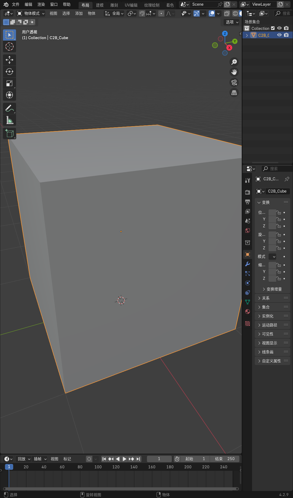

# Chat2Blend

> **让 ChatGPT 写一次，让 Blender 直接长出来。**

Chat2Blend（C2B）捕获 ChatGPT（或其他网页 LLM）正在输出的 Blender Python，并自动在已经打开的 Blender GUI 中执行它。不用复制粘贴，不用 OpenAI API Key，也不用让第二个 Coding Agent 再花 Token 写一遍建模代码。

```
用户
 ↓
ChatGPT 网页
 ↓
流式 Blender Python
 ↓
Chat2Blend 浏览器扩展
 ↓
本地 Bridge
 ↓
Blender 插件
 ↓
可见的 3D 模型
```

## 为什么存在

你已经为 ChatGPT/Claude/Gemini 付费。Coding Agent（Codex、Cursor 等）不应该再花 Token 重写同样的 `bpy` 代码。Chat2Blend 是一个**传输与执行层**，不是模型。它让你已有的 LLM 负责生成几何体，然后实时把几何体送进 Blender。

- **不需要 OpenAI API Key。** 使用用户已经登录的 ChatGPT 网页。
- **不浪费 Coding Agent Token。** Agent 只需说"用 Chat2Blend"。
- **流式执行。** 前面 chunk 已经在 Blender 里运行时，后面的 chunk 还在生成中。
- **本地优先。** 只监听 127.0.0.1，无隧道、无云端、无 SaaS。

## 状态

Windows：**已验证**（Blender 4.2.9，Chrome/Edge 扩展）
macOS：架构支持 / 实验性
Linux：架构支持 / 实验性

核心闭环真实跑通：`类 ChatGPT 流式 chunk → Bridge → Blender GUI → 3D 模型`。

## 快速开始

### 1. 环境要求

- Windows 10/11、macOS 或 Linux
- Node.js ≥ 20
- Blender 4.x
- ChatGPT 桌面端（Windows 为 MSIX 商店版）— 已登录

### 2. 安装

**方式 A — npm（推荐）**

```bash
npm install -g chat2blend
c2b version
```

npm 包内含 `c2b` CLI、编译好的 bridge、Blender 插件源码和 Agent Skill，**零运行时依赖**。

**方式 B — 源码**

```bash
git clone https://github.com/nanhudev/chat2blend.git
cd chat2blend
npm install
npm run build
```

### 3. 安装 Blender 插件

```bash
npm run package:blender
```

打开 Blender → `编辑 > 偏好设置 > 插件 > 安装...` → 选择 `dist/chat2blend-blender.zip` → 启用 **Chat2Blend**。插件会自动连接本地 bridge。

npm 安装时，插件源码随包一起发布，直接指向它即可：

```bash
c2b doctor          # 会打印解析出的插件源码路径
```

然后 `编辑 > 偏好设置 > 插件 > 安装...` → 选择
`<全局 node_modules>/chat2blend/blender_addon/chat2blend/__init__.py`。

### 4. 启动 Bridge

```bash
c2b start           # npm 安装
# 源码运行：
npm run c2b -- start
```

这会启动仅监听 127.0.0.1 的 HTTP 服务（8787）和 TCP 传输（8788）。

### 5. 挂接本地 ChatGPT 大脑

确保 ChatGPT 桌面端已启动并登录。

```bash
c2b brain-attach
# 源码运行：npm run c2b -- brain-attach
```

bridge 会找到该应用，挂到它的本地调试端口（默认 `127.0.0.1:9333`），并确认输入框可用。

### 6. 向本地 ChatGPT 提问

```bash
c2b brain "一个低多边形木质边桌"
c2b brain "..." --wait
# 源码运行：npm run c2b -- brain "..."
```

Blender 会在本地 ChatGPT 生成代码的同时把模型搭出来。

> **旧版浏览器扩展路径：** `apps/extension` 里的扩展代码仍然保留，但已不再推荐，详见 `apps/extension/DEPRECATED.md`。只有在无法安装 ChatGPT 桌面端时才用它。

## CLI

```bash
c2b <命令>               # npm 安装
npm run c2b -- <命令>    # 源码运行
```

| 命令 | 作用 |
|------|------|
| `version` | 打印版本、协议与运行时 |
| `start` | 启动 bridge 守护进程 |
| `stop` | 停止 bridge |
| `status` | 查看 bridge / Blender / 扩展状态 |
| `doctor` | 完整诊断 |
| `pair` | 显示新的配对码（旧版扩展） |
| `jobs` | 最近的任务 |
| `exec <file.py>` | 直接把 Python 文件送进 Blender |
| `prompt "任务"` | 打印 Chat2Blend 提示词模板 |
| `brain "任务"` | 把任务交给本地 ChatGPT 桌面端 |
| `brain-attach` | 挂接 / 启动本地 ChatGPT 应用 |
| `brain-status [id]` | 大脑健康状态或精简任务状态 |
| `logs` | 跟踪 bridge 日志 |
| `setup` | 首次运行引导清单 |

## 演示

一次真实 GUI 运行：启动 bridge、Blender 插件连接、`examples/cube.py` 被流式送进可见的 Blender 窗口。C2B_Cube 对象出现，全程无需复制粘贴。



## 架构

```
ChatGPT 网页
    ↓  DOM 流式抓取
浏览器扩展（捕获 + 去重 + 配对）
    ↓  localhost:8787 HTTP + token
本地 Bridge（任务、队列、认证、日志）
    ↓  localhost:8788 行分隔 JSON TCP
Blender 插件（主线程执行器、共享命名空间）
    ↓
Blender 场景
```

- **浏览器扩展**：Manifest V3 TypeScript，监控提供者 DOM，支持 ChatGPT，并提供**发送当前代码**的手动兜底。
- **Bridge**：零运行时依赖 Node.js，暴露 `/api/*` 路由，以及面向 Blender 的行分隔 JSON socket。
- **Blender 插件**：纯 Python stdlib + `bpy`。网络在后台线程运行；执行通过 `bpy.app.timers` 在主线程排空。

详见 [`docs/ARCHITECTURE.md`](docs/ARCHITECTURE.md)。

## C2B 协议（v1）

要让 LLM 支持流式执行，让它把代码包在：

```python
# C2B:CHUNK <name>
...python...
# C2B:END
```

规则：

- 使用 `bpy`、Blender 4.x API
- 先定义 helper，再使用
- 前面的 chunk 不能依赖后面的 chunk
- 每个 chunk 都是可独立执行的完整 Python 块

如果 LLM 不遵循协议，Chat2Blend 会在生成结束后回退为执行完整的 ` ```python ` 代码块。

详见 [`docs/PROTOCOL.md`](docs/PROTOCOL.md) 和 [`docs/STREAMING.md`](docs/STREAMING.md)。

## Agent 集成

Coding Agent 在 Chat2Blend 可用时不应该自己生成大段 `bpy`。应该：

```text
Use Chat2Blend to generate the Blender asset. First run `c2b status`; if Blender is not connected, tell the user to open Blender and enable the add-on. Then let the user ask ChatGPT from the browser extension.
```

参见 [`skill/SKILL.md`](skill/SKILL.md) 和 [`docs/AGENT_INTEGRATION.md`](docs/AGENT_INTEGRATION.md)。

## 安全

Chat2Blend 会执行 LLM 生成的 Python。这本身就是一把利剑。

- Bridge 仅绑定 **127.0.0.1**，不允许 `0.0.0.0`。
- 本地大脑只连接本机运行的 ChatGPT 桌面端（CDP 端口仅监听回环）。
- 非 `chrome-extension://` / `http://127.0.0.1` / `http://localhost` 来源会被拒绝。
- 我们不索要 ChatGPT 账号、OpenAI API Key 或浏览器 Cookie。

详见 [`docs/SECURITY.md`](docs/SECURITY.md)。如需报告漏洞，请看 [`SECURITY.md`](./SECURITY.md)。

## 文档

| 文档 | 内容 |
|------|------|
| [`docs/ARCHITECTURE.md`](docs/ARCHITECTURE.md) | 逐组件设计说明 |
| [`docs/PROTOCOL.md`](docs/PROTOCOL.md) | C2B/1 分块协议 |
| [`docs/STREAMING.md`](docs/STREAMING.md) | 流式解析与去重 |
| [`docs/AGENT_INTEGRATION.md`](docs/AGENT_INTEGRATION.md) | 在编码 Agent 中使用 |
| [`docs/SECURITY.md`](docs/SECURITY.md) | 威胁模型 |
| [`docs/ROADMAP.md`](docs/ROADMAP.md) | 后续计划 |
| [`CHANGELOG.md`](CHANGELOG.md) | 发布历史 |

## 参与贡献

欢迎提 issue、提想法、提 PR。请先读 [`CONTRIBUTING.md`](./CONTRIBUTING.md)（开发环境、目录结构、"不许假成功"原则、零运行时依赖策略）和 [行为准则](./CODE_OF_CONDUCT.md)。

## 开发

```bash
npm run build        # TypeScript + 扩展
npm run typecheck    # 仅 TypeScript
npm run test         # 解析器 + Bridge 集成测试
npm run build:extension
npm run package:blender
```

### 端到端验证

仓库包含真实 GUI E2E 测试。

本地大脑路径（需要 ChatGPT 桌面端已登录）：

```bash
node scripts/e2e-brain.mjs "一个低多边形木质边桌"
```

无需 LLM 的合成测试（从磁盘流式发送 chunk）：

```bash
node scripts/e2e-blender.mjs examples/sofa_chunks.py 1200
```

它会启动 bridge、打开 Blender GUI、连接插件、流式发送 C2B chunk，并验证场景中出现了模型。不需要真实 ChatGPT 会话。

## 路线图

- 多网页 LLM 适配器（Claude、Gemini、DeepSeek、Grok、本地 LLM）
- UI 中支持手动编辑 / 重试 / 跳过 chunk
- CI 用 headless 模式
- Godot 导出管线
- 团队 / 云端协作功能（不在核心中）

详见 [`docs/ROADMAP.md`](docs/ROADMAP.md)。

## License

MIT © Chat2Blend contributors

Chat2Blend 是独立开源项目，与 OpenAI、Blender 基金会**没有**隶属、背书或支持关系。"ChatGPT" 是 OpenAI 的商标，"Blender" 是 Blender 基金会的商标。使用时请遵守你所使用聊天订阅的服务条款。

## License

MIT © Chat2Blend contributors
