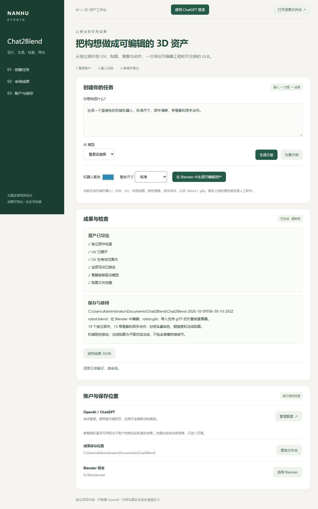

# Chat2Blend · 可检查的 3D 资产制作流程

面向 AI 产品经理 / 解决方案岗位的项目案例。

使用场景：非技术创作者希望获得可以继续编辑、进入引擎使用的 3D 资产。只生成几何体不能满足贴图、动画和后续制作需求。

产品决策：把“有模型”推进到“可交付资产”：独立部件 → UV → 材质贴图 → 骨骼权重 → 动作 → .blend 与 .glb。当前选择可重复验收的机械机器人配方；不声称任意提示词都能生成游戏级人物。

具体成果：19 个独立部件、15 根骨骼、挥手动作、基础色/粗糙度/法线贴图。机械部件采用刚性权重；法线图是平面切线法线，不是高模细节烘焙。

已验证：桌面按钮启动可见 Blender 并产生资产；实际 Blender 5.1.2 检查 UV、权重和几何体运动。GLB 重新导入后保留19个部件、15根关节、内嵌贴图和驱动几何体的动画。另有真实执行器的流式块、错误和新任务恢复测试。上述使用固定样板，未验证真实账户下的 AI 请求。

演示路线：打开桌面版 → 选择 Blender → 选择保存位置和配色 → 点击生成 → 在 Blender 编辑 → 将 robot.glb 导入支持 glTF 的工具检查动画。AI 登录用于将自然语言转为当前配方的配色和比例。

后续评价：首次有效导出时间、资产检查通过率、跨工具重新导入通过率、手工修复耗时。当前测试证明样板资产可用，没有真实创作者效果数据。

[桌面使用与构建](DESKTOP.md)

## 方案选择

| 候选方案 | 本版选择 | 对用户任务的影响 |
|---|---|---|
| 任意提示词直接执行生成代码 | 桌面初版采用受限配方参数 | 降低无效输出和任意代码执行风险，保留既有 CLI 作为专业入口 |
| 优先扩展大量造型 | 先完成机械资产全流程 | 独立部件、贴图和动画比仅增加几何体更接近用户交付任务 |
| 文件存在就视为资产成功 | 重新导入并检查实际运动 | 导出成功不等于贴图、权重和动画可以使用 |

## 评价口径与发布门槛

以下是待收集的产品指标，不是已经取得的成绩。

| 指标 | 测量方式 | 当前证据 |
|---|---|---|
| 首次有效成果时间 | 从打开应用到成果通过检查，失败任务单独计入 | 未收集真实用户样本 |
| 任务通过率 | 通过预先约定验收的任务数 / 尝试任务数，按任务类型区分 | 仅有测试场景，不能外推 |
| 恢复能力 | 按授权、生成、执行、导出记录失败原因与重试结果 | 已有相应软件边界检查 |
| 人工复核负担 | 记录每次复核耗时和修改原因，与同任务原流程比较 | 未收集真实用户基线 |

下一步先用本人官方账户完成真实请求，再邀请目标用户完成典型任务并观察失败点；得到记录后再决定扩展范围。不会用模型列表、模拟任务或安装成功代替真实 AI 和用户效果验证。

[下载安装与三分钟上手](QUICKSTART.md) · [简历与面试描述](RESUME.md) · [作品集入口](PORTFOLIO.md)
